Чтобы создать блог на Github Pages потребуется аккаунт на Github и начальные
знания системы контроля версий git.

## Регистрация на GitHub

Создание блога на [github pages](https://pages.github.com/) укаладывается в
несколько шагов. Первый шаг заключается в создании аккаунта на github. Процедура
регистрации простая. Сложностей возникнуть не должно, от себя лишь добавлю, что
двухфакторную аутентификацию все же лучше применять, поэтому посоветую сразу её
включить в настройках аккаунта Github. В качестве метода двухфакторной
аутентификации будет использоваться TOTP (Time-based one-time Password
algorithm) мобильного приложения, к примеру, я на Android применяю
[Aegis](https://play.google.com/store/apps/details?id=com.beemdevelopment.aegis).

## Создание нового репозитория на GitHub

После создания аккаунта на github, нужно создать пустой репозиторий на github.


Имя репозитория можно выбрать любое, впоследствие github предложит возможность
задать кастомное доменное имя для сайта. **Репозиторий должен быть публичным**.

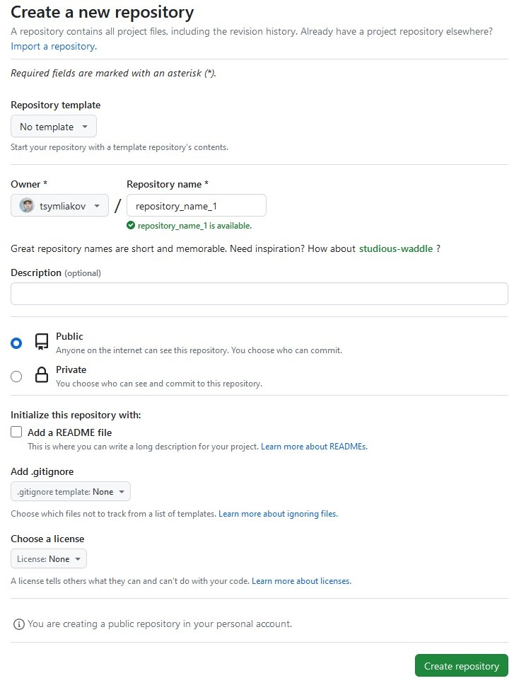

После создания репозитория на github следует инициализировать репозиторий git у
себя на компьютере. Именно в этом репозитории будут находиться статические html
файлы, которые будет использовать Github Pages для отображения сайта.

## Создание нового локального git-репозитория и его настройка

Синтаксис стандартный:

``` bash
mkdir blog_name
git init
```

После этого необходимо "связать" созданный удаленный репозиторий на github и
локальный репозиторий.

``` bash
git remote add origin git@github.com:your_github_username/repository_name_1.git
git branch -M main
```

`git remote add` связывает локальный и удаленный репозитории. `git branch` с
ключом `-M` создает новую ветку `main` взамен ветки `master`. Этого требуют
правила github. Подробнее можно ознакомиться
[тут](https://habr.com/ru/news/506876/).

## Добавляем index.html и пушим в прод

Название параграфа крайне прямолинейно, создаем index.html и пушим в прод. Так
что, какими бы то ни было средствами, делаем корректный html-документ.

Лично мне нравится возможность, которую предоставляет vscode через инструмент
Emmet. Достаточно лишь написать `!` или `!!!` и автодополнение сделает всю
работу по написанию шаблона html- страницы.

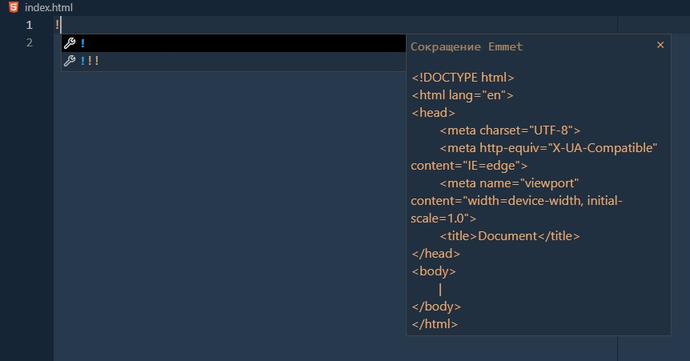

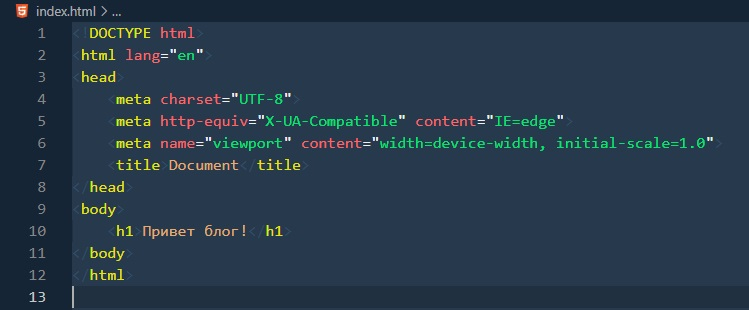

Теперь добавляем index.html в stash гита:

``` bash
git add index.html
```

Создаем коммит:

``` bash
git commit -m "Создал простой index.html"
```

И пушим. При первом пуше следует указать удаленный репозиторий, но впоследствие
git будет помнить про origin как про место назначения по- умолчанию.

``` bash
git push -u origin main
```

Теперь созданный файл должен быть виден в веб-интерфейсе github:

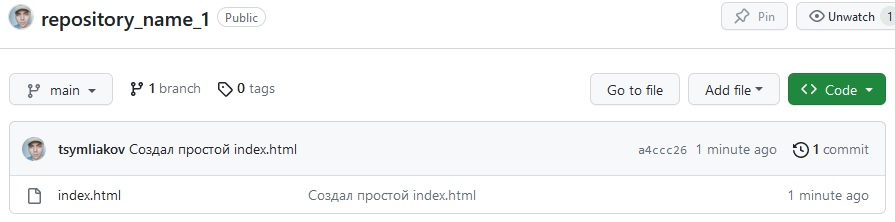

## А сайт с блогом- то когда появится?

Остается дело за малым, залезь в настройки репозитория и указать, откуда
github'у следует брать данные для поддержания статического веб-сайта, то есть
блога.

Лезем в настройки репозитория:

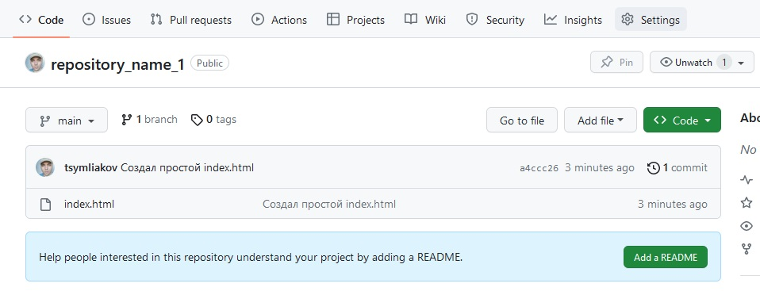

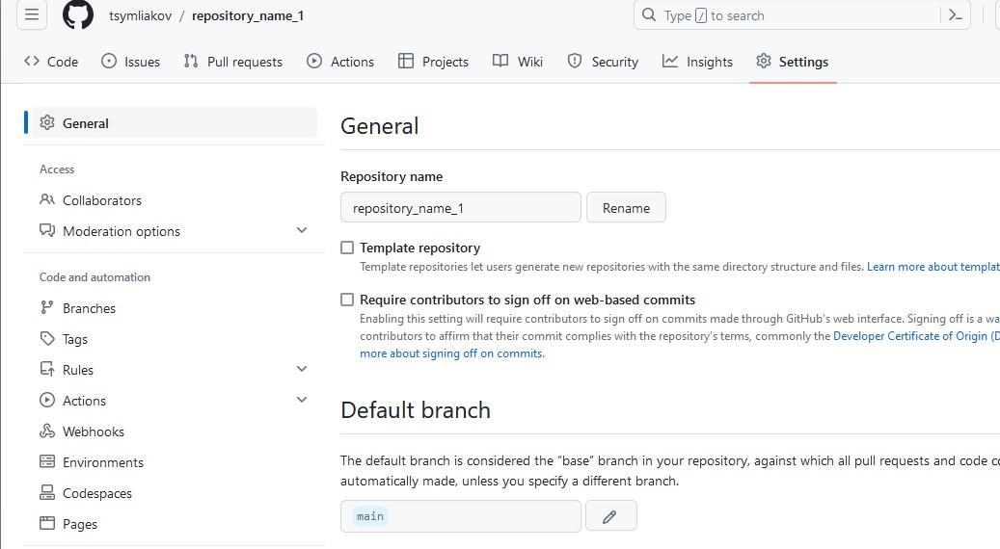

Слева находим раздел `Pages` и залезаем в него:

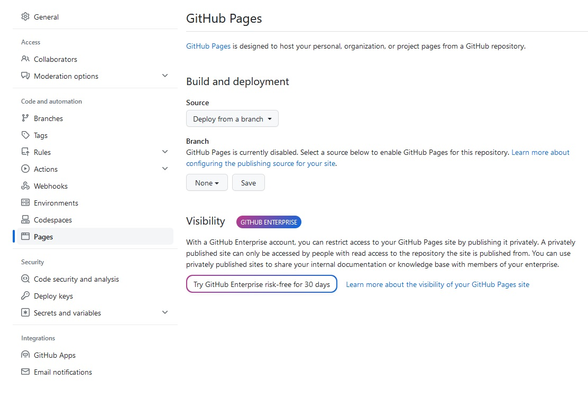

Внутри есть настройка, которая отвечает за то, с какой ветки github будет брать
файлы, указываем main.

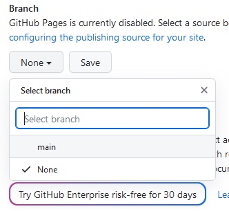

Сохраняем результат:

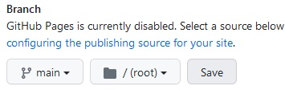

Github начинает размещение сайта.

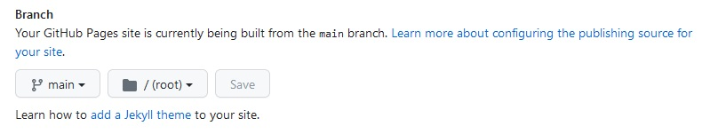

После того, как всё будет готово, github предложит ссылку на сайт.

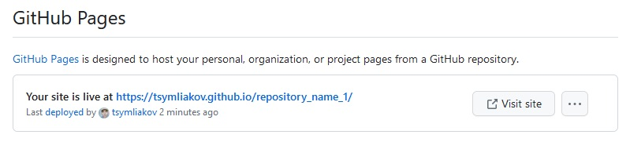

Перейдя по ссылке, можно увидеть, что созданный ранее html файлик теперь совсем
взрослый, живет своей почти самостоятельной жизнью на Github Pages.

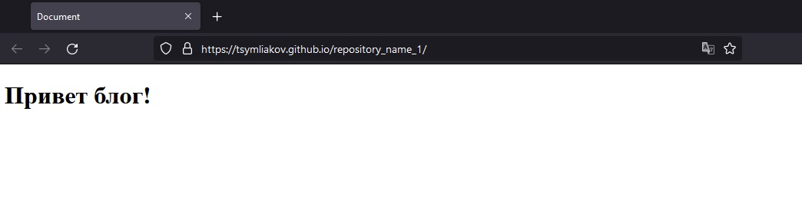

## Заключениe

Сайт был создан, выглядит он, быть может и не слишком казисто, почти как в том меме:


Возможно сделать блог красивее, для этого следует прибегнуть к одному из двух
способов:

1. Оттачивать и применять мастерство в верстке статических html сайтов;
2. Применить для этих дел готовый генератор статических сайтов, такой как
   [Jekyll](https://jekyllrb.com/), [Hugo](https://gohugo.io/) или любой другой.

Как правило, для генератора неоходимо написать текст в формате Markdown или
чем- то подобном, после чего генератор сам применит красивую тему и сгенерирует
html. Лично мне второй вариант нравится больше. Мой блог на момент написания
этого поста был сгенерировать с применением Jekyll. А за сим, прощаюсь :)
