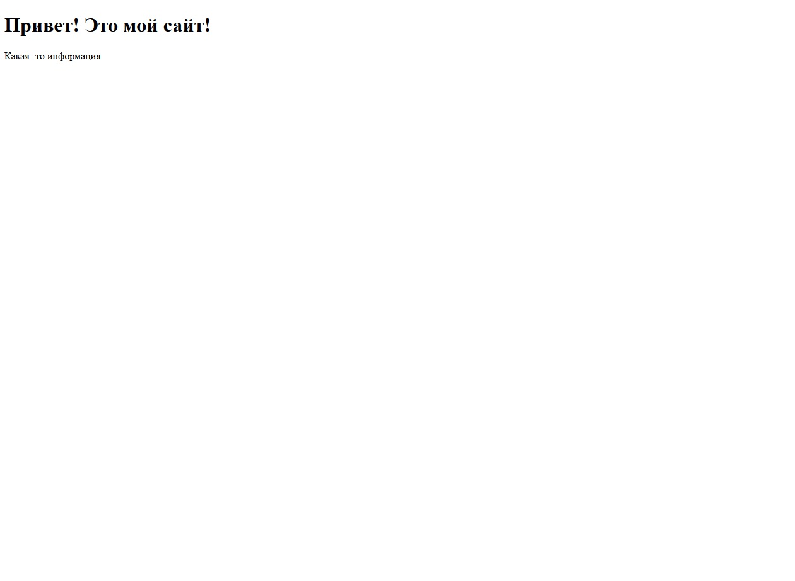
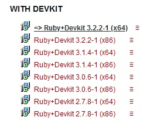
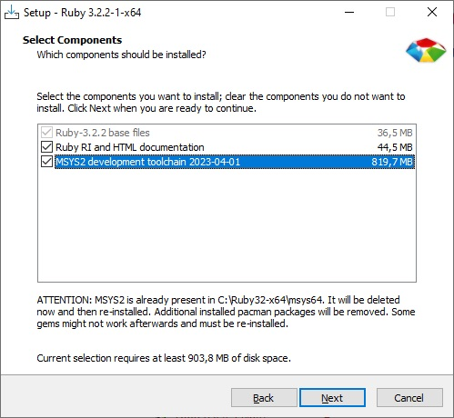
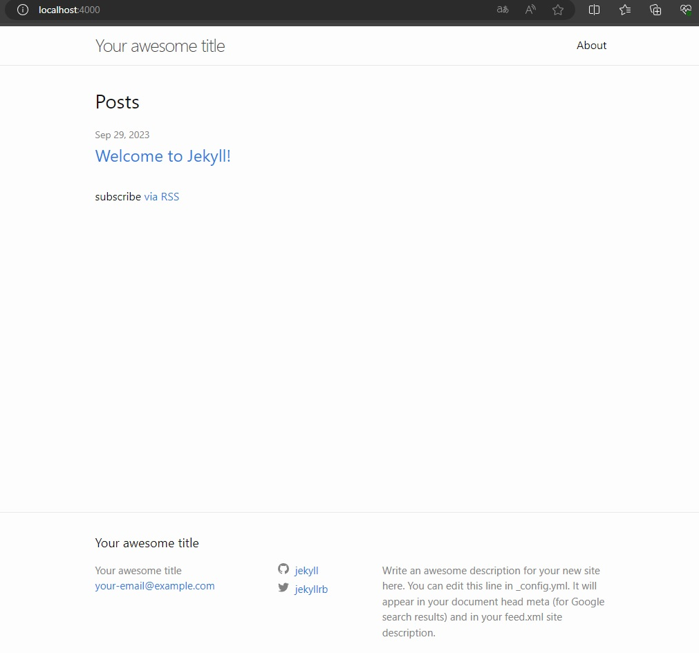
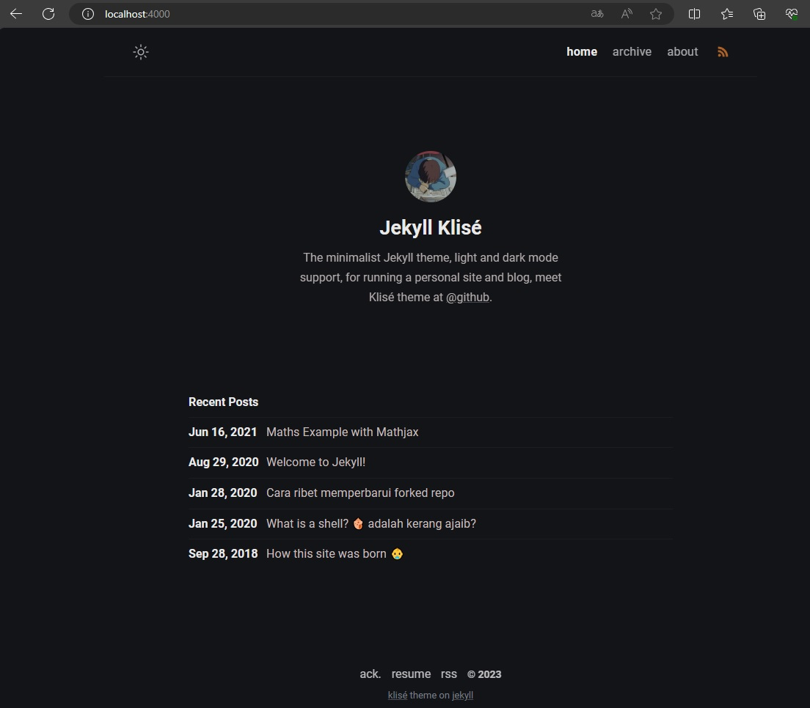

Ваш сайт выглядит как- то так?



Краски и эффекты не то, чтобы покинули его, а скорее просто никогда не
появлялись?

Решение этому есть! **Генераторы статических сайтов!** В данной статье речь
пойдет о [Jekyll](https://jekyllrb.com/). Лишь слегка пост затронет процедуру
установки.

# Установка на Windows

Jekyll представляет собой программу, написанную на Ruby, в следствие этого, для
работы ему требуется интерпретатор Ruby. Чтобы с легкостью установить Ruby на
Windows, следует установить RubyInstaller
[RubyInstaller](https://rubyinstaller.org/downloads/). Причем обязательно
следует выбрать версию с DevKit.



Во время установки следует отметить компонент MSYS2 Development Toolchain для
установки.



Далее остается лишь соглашаться с установщиком и не изменять стандартые
параметры без необходимости.

После установки следует удостовериться в том, что ruby установлен. Для этого
достаточно ввести следующую команду:

``` powershell
PS C:\Users\user\Desktop> ruby -v
ruby 3.2.2 (2023-03-30 revision e51014f9c0) [x64-mingw-ucrt]
```

# Создание блога

Чтобы создать базовый проект, следует установить jekyll.

``` powershell
PS C:\Users\user\Desktop\blog> gem install jekyll
Successfully installed jekyll-4.3.2
```

Затем можно создать jekyll-проект:

``` powershell
PS C:\Users\user> jekyll new new_blog
Running bundle install in C:/Users/user/new_blog...
  Bundler: Fetching gem metadata from https://rubygems.org/............
  Bundler: Resolving dependencies...
  Bundler: Bundle complete! 7 Gemfile dependencies, 36 gems now installed.
  Bundler: Use `bundle info [gemname]` to see where a bundled gem is installed.
New jekyll site installed in C:/Users/user/new_blog.
```

Команда `jekyll serve`, запущенная внутри директории с проектом, запустит
локальный web-сервер jekyll, на котором будет хоститься только что созданный
проект.

``` powershell
PS C:\Users\user\new_blog> jekyll serve
Configuration file: C:/Users/user/new_blog/_config.yml
            Source: C:/Users/user/new_blog
       Destination: C:/Users/user/new_blog/_site
 Incremental build: disabled. Enable with --incremental
      Generating...
       Jekyll Feed: Generating feed for posts

Run in verbose mode to see all warnings.
                    done in 1.911 seconds.
 Auto-regeneration: enabled for 'C:/Users/user/new_blog'
    Server address: http://127.0.0.1:4000/
  Server running... press ctrl-c to stop.
```

Теперь блог доступен по адресу `localhost:4000`



Круто. Но что делать, если хочется использовать другую тему?

# Применение отличной от стандартной темы в Jekyll

В Jekyll темы строго привязаны к проекту. Иными словами, каждый набор исходников
представляет собой свою тему. Например, я использую эту
[тему](https://github.com/piharpi/jekyll-klise).

Чтобы её применить, необходимо скопировать репозиторий:

``` powershell
PS C:\Users\user> git clone https://github.com/piharpi/jekyll-klise
Cloning into 'jekyll-klise'...
remote: Enumerating objects: 763, done.
Receiving objects:  95% (725/763), 3.32 MiB | 3.17 MiB/sremote: Total 763 (delta 0), reused 0 (delta 0), pack-reused 76
Receiving objects: 100% (763/763), 5.19 MiB | 3.44 MiB/s, done.
Resolving deltas: 100% (336/336), done.
```

``` powershell
PS C:\Users\user> cd .\jekyll-klise\
```

Необходимо установить зависимости темы:

``` powershell
PS C:\Users\user\jekyll-klise> bundle install
Fetching gem metadata from https://rubygems.org/............
...
```

И непосредственно запуск:

``` powershell
PS C:\Users\user\jekyll-klise> bundle exec jekyll serve
Configuration file: C:/Users/user/jekyll-klise/_config.yml
            Source: C:/Users/user/jekyll-klise
       Destination: C:/Users/user/jekyll-klise/_site
 Incremental build: disabled. Enable with --incremental
      Generating...
       Jekyll Feed: Generating feed for posts
                    done in 0.926 seconds.
 Auto-regeneration: enabled for 'C:/Users/user/jekyll-klise'
    Server address: http://127.0.0.1:4000
  Server running... press ctrl-c to stop.
```

В результате получаем собственный сайт с другой темой. Аналогичным образом
осуществляется работа и с другими темами.


