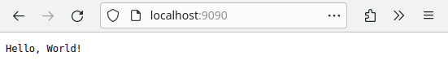
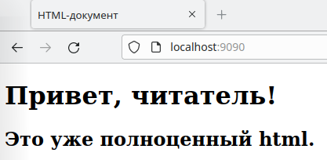

### Как реализовать простейшее WSGI приложение и открыть к нему доступ через uWSGI

Напишем, пожалуй, самое простое приложение, реализующее протокол WSGi, а также установим WSGI сервер под названием **uWSGI**, который будет запускать наше приложение.  Я это проделаю в Linux, для иных операционных систем действия аналогичные за исключением активации виртуального окружения.

Создаем директорию и создаем в ней виртуальное окружение для python;

``` bash
user@vm:~/Desktop$ mkdir venv && python3 -m venv ./venv/
```

Активируем созданное виртуальное окружение.

``` bash
user@vm:~/Desktop$ source venv/bin/activate
```

В случае успеха, командная строка должна измениться:

``` bash
(venv) user@vm:~/Desktop$
```

Теперь будут использоваться python и pip из этого виртуального окружения.

Создаем директорию для проекта, файл-приложение в ней и сразу переходим в эту директорию.

``` bash
(venv) user@vm:~/Desktop$ mkdir my_server && touch my_server/app.py && cd my_server
```

Каким угодно образом помещаем в файл-приложение исключительно следующий код:

``` python
def application(environ, start_response):
    start_response('200 OK', [('Content-Type', 'text/plain')])
    yield b'Привет, читатель!\n'
```

Установим uWSGI, представляющий собой сервер приложений.

``` bash
(venv) user@vm:~/Desktop/my_server$ pip install uwsgi
```

Теперь можно запускать.

``` bash
(venv) user@vm:~/Desktop/my_server$ uwsgi --http :9090 --wsgi-file app.py
```

Приведенная команда запускает uWSGI на порту 9090, а в качестве приложения, которое будет обрабатывать пользовательские запросы, будет использоваться ранее созданный app.py

Можно удостовериться в работоспособности этого всего с помощью браузера, не закрывая консоль, а значит, не прекращая исполнения uWSGI сервера, заходим на `localhost:9090`. Нас встречает html страница.



А дальше остается лишь чуть попрограммировать и можно будет мемы отдавать клиентам.

Можно возвращать и полноценный html файл. Делается это следующим образом, первым делом создается файл html, например, рядом с приложением app.py:

``` html
<!DOCTYPE html>
<html lang="ru">
<head>
    <meta charset="UTF-8">
    <meta name="viewport" content="width=device-width, initial-scale=1.0">
    <title>HTML-документ</title>
</head>
<body>
    <h1>Привет, читатель!</h1>
    <h2>Это уже полноценный html.</h2>
</body>
</html>
```

Перезапускаем uWSGI уже известной командой. И заходим на уже озвученный адрес localhost:9090.



### Замена встроенного сервера в Django на uWSGI

В двух словах: никто не использует в production сервер приложений, встроенный в django поскольку он медленный, он предназначен для нужд разработчика, а не для обеспечения работы с тысячами подключений.

В общем- то, нужно раздобыть django приложение, поэтому устанавливаем в виртуальное окружение django.

``` bash
(venv) user@vm:~/Desktop$ pip install django
```

Создаем папку для проекта.

``` bash
(venv) user@vm:~/Desktop$ mkdir django_proj
```

Создаем django проект внутри директории.

``` bash
(venv) user@vm:~/Desktop$ django-admin startproject project django_proj/
```

Если запустить проект сейчас, он запустится на встроенном в django WSGI-сервере.

``` bash
(venv) user@vm:~/Desktop$ django_proj/manage.py runserver
Watching for file changes with StatReloader
Performing system checks...
...
```

Существует несколько способов запуска проекта на uWSGI. Можно запустить проект через ini файл, можно использовать параметры по- умолчанию и произвести запуск одной командой.

``` bash
(venv) user@vm:~/Desktop$ cd django_proj/ && uwsgi --module=project.wsgi --http :8001
```

Все, можно удостовериться, что приложение работает, обратившись к порту 8001 по http. В случае, если веб-сервер отдает страницу с текстом "Internal server error", проблема скорее всего заключается в том, что uwsgi у вас проблема с путями. Попробуйте переместиться в папку с проектом и запускать uwsgi от туда, или же применяйте аргумент chdir:

``` bash
uwsgi --chdir=/path/to/your/project ...
```

### Конфигурирование uWSGI для работы в режиме production

Для работы в "боевом" режиме способ, описанный выше не до конца подходит, ему не достает гибкости. Можно было бы добавить аргументов команде запуска, но это не серьезный подход, в конце концов, её надо было бы где- то хранить!

Вместо этого создадим конфигурационный файл для uWSGI в корне django-проекта.

``` bash
(venv) user@vm:~/Desktop/django_proj$ touch uwsgi.ini
```

Опишем +- классическую конфигурацию uWSGI в этом файле.

``` ini
[uwsgi]
# путь до wsgi-файла, сгенерированного Django
wsgi-file = project/wsgi.py

strict = true  # предотвращает запуск сервера, если он неправильно настроен
socket = :8000  # порт, на котором принимаются запросы пользователей
protocol = http

# запустить мастер-процесс для управления дочерними процессами
master = true

# завершить все дочерние процессы
no-orphans = true

# остановить сервер при получении сигнала SIGTERM
die-on-term = true

# ленивая инициализация приложения
# это позволяет запускать сервер быстрее
# первый запрос, полученный процессом, будет работать медленно
#так как приложение будет инициализироваться.
lazy-apps = true

# количество процессов, создаваемое мастер-процессом
# рекомендуется поставить число, не превышающее количество доступных ядер процессора
processes = 4

# количество потоков, используемых каждым процессом
# каждый запрос от пользователя обрабатывается в отдельном потоке
# с помощью этих настроек можно установить максимальное количество обрабатываемых запросов
# в этой конфигурации сервер сможет обработать 32 запроса одновременно
# это число получили, умножив количество процессов на количество потоков
threads = 8

# по умолчанию uWSGI не инициирует GIL, поэтому потоки не будут работать внутри приложения
enable-threads = true

# через какое количество запросов перезапустить воркер
# это полезно для профилактики утечек памяти
max-requests = 500

# принудительно перезагрузить воркер, если он превысит порог по потребляемой памяти
reload-on-rss = 1024

# как долго ждать обработки текущих запросов воркером до принудительной перезагрузки
worker-reload-mercy = 60

# через сколько секунд принудительно завершить запрос от пользователя
harakiri = 60
harakiri-verbose = true

# очистить временные файлы и UNIX-сокеты, используемые сервером
vacuum = true

# прежде чем передать запрос приложению
# uWSGI считает в памяти его содержимое
post-buffering = 1048576

# размер буфера для чтения HTTP-заголовков
buffer-size = 65535
```

Все, полетели. Запуск производится через передачу приложению uwsgi созданного ini-файла.

``` bash
(venv) user@vm:~/Desktop/django_proj$ uwsgi --ini uwsgi.ini
```
