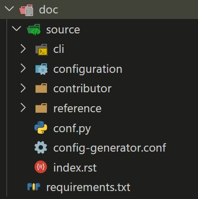
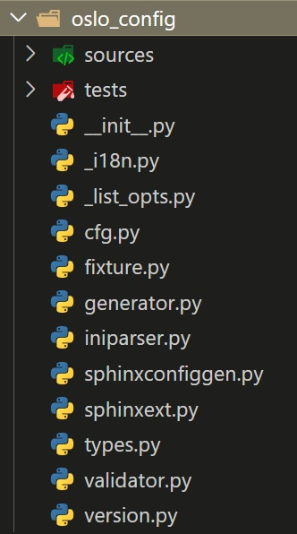

+++
title = 'Что внутри enterprise python пакета?'
date = 2024-02-05T13:34:18+03:00
draft = false
+++

Современные крупные и сложные проекты на python предназначенные для пользования другими людьми, доступные для общественности, содержат далеко не 2 с половиной кодовых файла в одной единственной папке. Внутри проекта может храниться, кажется, всё, что напрямую к программе не имеет отношения. Это и файлы, описывающие зависимости да еще может так случиться, что не один вид зависимостей: и development, и production и даже test зависимости. Для некоторых проектов пишется документация в формате `.rst`, которая затем, как правило, может быть "собрана" на компьютерах интересующихся пользователей посредством Sphinx. В общем и целом, пакеты принадлежат к той или иной лицензии, что ведет к появлению в проекте файликов, описывающих юридическими терминами "что-то". Ну и уж совсем нельзя упомянуть про файлы, предназначенные для сборки/упаковки python проекта в нечто удобоваримое для дистрибьюции. Иными словами, для создания дистрибутива, который затем можно распространять среди пользователей посредством PyPi или на дискетах.

Итак, в рамках этой статьи, возьмем для рассмотрения не самый большой, не самый сложный и даже не самый известный пакет из Интернета и разберем его на составляющие части. На примере пакета [oslo.config](https://pypi.org/project/oslo.config/) я расскажу, зачем нужны те или иные файлы. Сам по себе пакет oslo.config предлагает свое использование в других проектах, в которых он может предоставить удобный способ получения параметров из командной строки или из `.ini` конфигурационных файлов.


# Директория doc

В этой директории, как следует из названия, находится документация к проекту. Находится она тут по большей части в виде файлов формата `.rst`. Внутри doc содержатся поддиректория source и файл requirements.txt



Директория source содержит файлы документации, организованные удобным образом для системы сборки документации [Sphinx](https://www.sphinx-doc.org/en/master/). Зависимости файла по соседству необходимы, чтобы получилось "собрать документацию".

Содержимое файла с зависимостями для сборки документации:
```
# The order of packages is significant, because pip processes them in the order
# of appearance. Changing the order has an impact on the overall integration
# process, which may cause wedges in the gate later.

sphinx>=1.8.0,!=2.1.0 # BSD
sphinxcontrib-apidoc>=0.2.0  # BSD
openstackdocstheme>=1.20.0 # Apache-2.0
reno>=2.5.0 # Apache-2.0
fixtures>=3.0.0 # Apache-2.0/BSD
doc8>=0.6.0 # Apache-2.0
```

# Директория oslo_config

Директория oslo_config содержит непосредственно исходники библиотеки. "Почему часть кодовых файлов содержится в корне директории oslo_config, а другая часть находится внутри поддиректории sources?" - может спросить у меня читатель. "Я не знаю" - отвечу я. Для понимания этого момента необходимо быть в контексте внутреннего устройства библиотеки, а может быть и истории её разработки. В поддиректории tests содержатся кодовые файлы с тестами.



# Директория oslo.config.egg-info

Это директория, содержащая метаданные проекта, важные в контексте питоновских яиц. Питоновское яйцо или же "python egg" - это логическая структура, представляющая собой релиз конкретной версии Python проекта. Загадочная "логическая структура" может быть представлена в материальном мире посредством одного из множества способов. Иначе говоря, **существует несколько видов питоновских дистрибутивов**.

Формат `.egg-info` - один из способов представления питоновского яйца в реальном мире. Метаданные, хранящиеся внутри этой директории, позволяют отслеживать pip'у и подобным инструментам, какие пакеты установлены в системе и от чего они зависят.

Тема создания и подготовки своего пакета для дистрибьюции в общем и темя питоновских яиц в частности выходят за рамки этой статьи, поэтому будут рассмотрены в иной раз.

# Директория releasenotes

Из названия становится ясно, что в директории находятся файлики, содержащие инфу о релизах библиотеки. В принципе, наличие такой директория не является общеобязательным, команда Openstack (они же и написали рассматриваемую в этой статье библиотеку) избрала такой способ ведения документации о релизах. Они используют для этого свой инструмент под названием reno. Если хотите, можете ознакомиться с этим [тут](https://docs.openstack.org/reno/latest/user/usage.html#creating-new-release-notes).

# Популярные файлы

Эти файлы можно встретить в подавляющем большинстве репозиториев python- пакетов, поэтому они заслуживают внимания.

## requirements.txt

Файл описывает зависимости пакета. Как правило для работы в development среде. Использование "больше либо равно" по отношению к версии пакета-зависимости **я считаю ошибочным**. Спустя время публичный интерфейс пакета, который прописан в requirements.txt, изменится. Что приведет к неработоспособности текущей версии пакета, в данном случае, oslo_config. Ведь обычно никто особо не тестирует старые релизы продукта на совместимость с новыми версиями библиотек, от которых он зависит, если, конечно, это не lts версия.

Ошибка может быть крайне трудноуловимой, а что самое подлое- ошибка будет в файле requirements.txt, который с виду выглядит абсолютно правильным.

Мой совет- необходимо использовать "равно" в файле requirements.txt и по возможности "двигать" версии зависимостей вверх, но обязательно тестируя на совместимость.

```
# The order of packages is significant, because pip processes them in the order
# of appearance. Changing the order has an impact on the overall integration
# process, which may cause wedges in the gate later.

debtcollector>=1.2.0 # Apache-2.0
netaddr>=0.7.18 # BSD
stevedore>=1.20.0 # Apache-2.0
oslo.i18n>=3.15.3 # Apache-2.0
rfc3986>=1.2.0 # Apache-2.0
PyYAML>=5.1 # MIT
requests>=2.18.0 # Apache-2.0
```

## test-requirements.txt

Зависимости, необходимые для запуска тестов.

## setup.py

Этот файл нужен для инструмента [setuptools](https://setuptools.pypa.io/en/latest/index.html), который предназначен для формирования дистрибутива из python проекта.

``` python
import setuptools

setuptools.setup(
    setup_requires=['pbr>=2.0.0'],
    pbr=True)
```

## setup.cfg

Конфиг для setuptools.
# Россыпь оставшихся файлов

## .coveragerc

Файл содержит конфигурацию, которую понимает pytest-cov - [плагин для pytest](https://pytest-cov.readthedocs.io/en/latest/readme.html).

```
[run]
branch = True
source = oslo_config
omit = oslo_config/tests/*

[report]
ignore_errors = True
precision = 2
```

## .pre-commit-config.yaml

Один из файликов, специфичных для этого проекта, не интересно. Предназначен для работы одного из инструментов команды Openstack.

## .stestr.conf

Конфигурационный файл для инструмента [stestr](https://stestr.readthedocs.io/en/latest/README.html#overview). Он позволяет запускать тесты в параллельном режиме.

```
[DEFAULT]
test_path=.
top_dir=./
```

## .zuul.yaml

Конфиг для [Zuul](https://zuul-ci.org/docs/zuul/latest/about.html). Это фреймворк для построения CI/CD конвейера, но специализирующийся на тестировании.

```
- project:
    templates:
      - check-requirements
      - lib-forward-testing-python3
      - openstack-python3-jobs
      - periodic-stable-jobs
      - publish-openstack-docs-pti
      - release-notes-jobs-python3
```

## AUTHORS

Файлик с перечислением авторов проекта. Файл нужен для того, чтобы предоставить список людей, чей вклад в проект оказался ценным в глазах владельца репозитория.

## bindep.txt

Файлик для утилиты [bindep](https://docs.opendev.org/opendev/bindep/latest/readme.html).  Утилита занимается отслеживанием бинарных зависимостей пакета. Её можно отнести к **Openstack- line** утилитам.

```
# This is a cross-platform list tracking distribution packages needed by tests;
# see http://docs.openstack.org/infra/bindep/ for additional information.

locales [platform:debian]
python3-all-dev [platform:ubuntu !platform:ubuntu-precise]
python3-dev [platform:dpkg]
python3-devel [platform:fedora]
```

## ChangeLog

Файл хранит историю изменений проекта. Историю изменений можно вести как так, так и иначе.

## CONTRIBUTING.rst, HACKING.rst, LICENSE, PKG-INFO, README.rst

Файлы +- Openstack- специфичные, так что не интересно их рассматривать.
